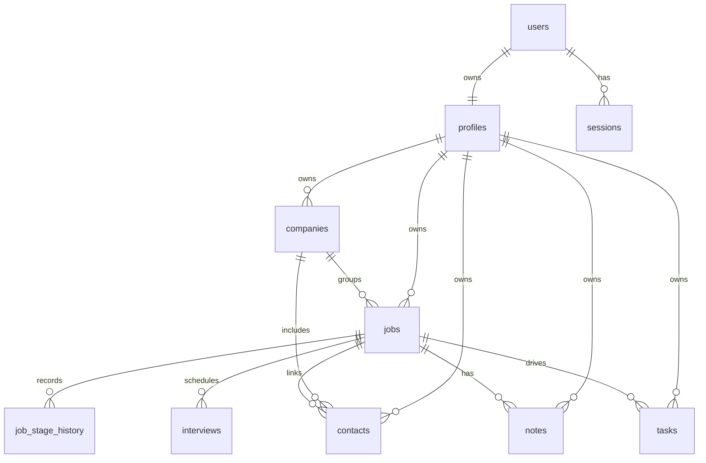

# Offer Track

Offer Track is a full-stack job search workspace built with Next.js, TypeScript, Drizzle, and PostgreSQL. It gives one focused place to manage opportunities, move them through a hiring pipeline, capture recruiter context, schedule interviews, track follow-ups, and inspect funnel metrics.

## Project Overview

This project is designed as a compact operating system for an active job search:

- track opportunities from wishlist to offer or rejection
- switch between kanban and table views depending on workflow
- keep notes, interviews, contacts, and follow-up tasks attached to the job itself
- surface dashboard and analytics signals without leaving the app

## Problem

Most job searches end up fragmented across spreadsheets, notes apps, calendars, and email threads. That fragmentation creates three recurring problems:

- pipeline status becomes stale
- follow-up actions get missed
- context about companies, recruiters, and interview loops gets lost

Offer Track solves that by treating each job as the center of the workflow and keeping related actions and signals in one place.

## Features

- authentication with sign up, sign in, logout, and protected routes
- dashboard with summary cards, overdue follow-ups, upcoming interviews, and recent activity
- jobs CRUD with schema-validated forms
- kanban pipeline with drag-and-drop and optimistic status updates
- table view with search, filters, sorting, pagination, and column visibility
- job detail page with stage history, notes, interviews, contacts, and follow-up tasks
- companies page with connected jobs and stage summaries
- contacts page with recruiter and hiring manager context
- tasks page with open and completed follow-ups
- analytics page with funnel metrics, response rate, interview rate, rejection count, and source breakdown
- responsive dashboard shell, dark mode support, toast feedback, and confirm dialogs

## Tech Stack

- framework: Next.js App Router, React 19, TypeScript
- styling: Tailwind CSS v4, shadcn/ui primitives, Lucide icons
- data fetching and cache sync: TanStack Query
- forms and validation: React Hook Form + Zod
- persistence: PostgreSQL + Drizzle ORM
- mutations: Next.js Server Actions
- deployment: Railway
- testing: Vitest + Testing Library

## Architecture Decisions

- TanStack Query is used for server-backed list and detail surfaces such as jobs, companies, contacts, tasks, and analytics. That keeps refresh and cache invalidation consistent across pages.
- React Hook Form with Zod is used for data-entry flows such as job, contact, interview, and task forms. This keeps client validation aligned with server expectations.
- URL state owns search, filters, sort order, and current jobs view. That makes pages shareable and keeps back/forward navigation predictable.
- Local UI state is reserved for ephemeral interactions such as column visibility, modal state, sticky toolbars, and confirmation flows.
- Server Actions are used for mutations so validation, redirects, and revalidation stay close to the domain logic.
- The data model is job-centric: contacts, notes, interviews, tasks, and stage history all connect back to the job record.

## Database Schema

Core entities:

- `users`
- `profiles`
- `sessions`
- `companies`
- `jobs`
- `job_stage_history`
- `contacts`
- `notes`
- `interviews`
- `tasks`



Domain enums:

- job status: `wishlist`, `applied`, `hr_screen`, `technical`, `final`, `offer`, `rejected`
- work mode: `remote`, `hybrid`, `onsite`
- interview type: `hr`, `technical`, `final`

## Screenshots

Planned final captures for the README:

- dashboard overview with summary cards and overdue tasks
- jobs kanban board
- jobs table view with filters and sticky toolbar
- job details page with notes, timeline, and workflow panels
- tasks page
- analytics page
- mobile dashboard or jobs view

## Setup Instructions

### Prerequisites

- Node.js 22+
- local PostgreSQL running on `127.0.0.1:5432`

### Local Setup

1. Install dependencies:

   ```bash
   npm install
   ```

2. Copy environment variables:

   ```bash
   cp .env.example .env.local
   ```

3. Create the database:

   ```bash
   createdb -U postgres offer_track
   ```

4. Apply migrations:

   ```bash
   npm run db:migrate
   ```

5. Seed demo data:

   ```bash
   npm run db:seed
   ```

6. Start the app:

   ```bash
   npm run dev
   ```

### Useful Commands

```bash
npm run build
npm run test:backend
npm run test:frontend
npm run db:generate
npm run db:push
npm run db:studio
```

## Future Improvements

- add final screenshots and a short product walkthrough to the README
- support a detail drawer option in addition to full-page job details
- add bulk actions for table and kanban workflows
- expand analytics with richer visual charts and time-based trends
- add notifications or reminders for overdue follow-ups
- add end-to-end smoke coverage for the deployed environment
